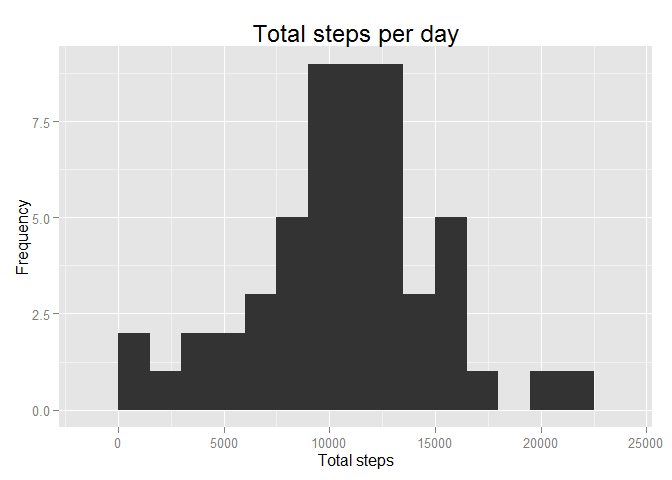
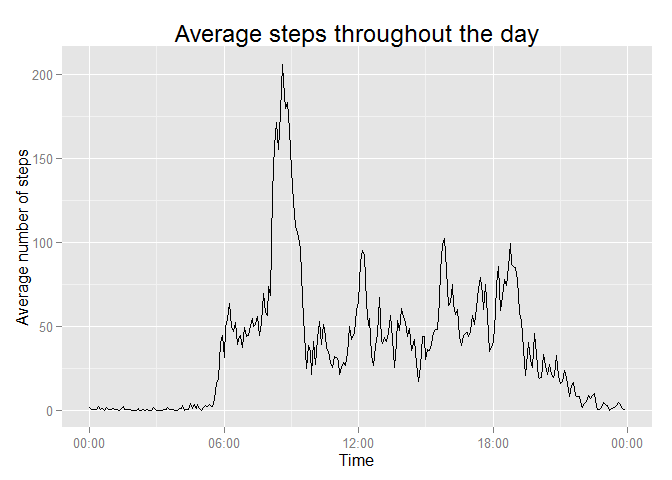
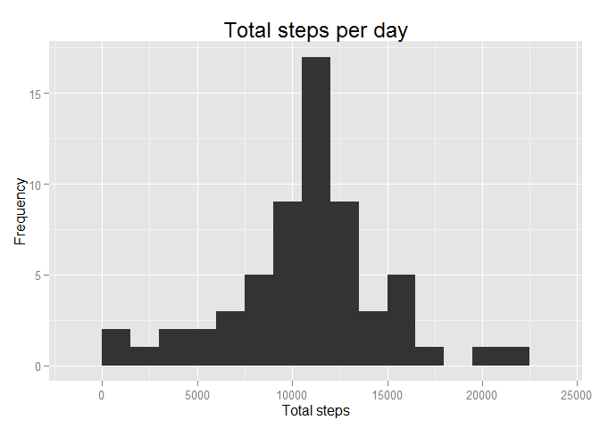
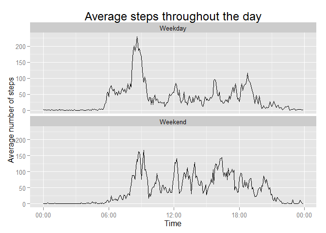

# Reproducible Research: Peer Assessment 1


## Loading and preprocessing the data
Load the data and format the date/times:

```r
library(dplyr)
```

```
## 
## Attaching package: 'dplyr'
## 
## The following object is masked from 'package:stats':
## 
##     filter
## 
## The following objects are masked from 'package:base':
## 
##     intersect, setdiff, setequal, union
```

```r
library(tidyr)
library(ggplot2)
library(scales)
dat <- read.csv("C:/Users/Derek/Documents/My Dropbox/R Working Directory/activity.csv")
dat$date <- as.Date(dat$date)
dat$interval <- sprintf("%04d",dat$interval)
dat$interval <- sub("([[:digit:]]{2,2})$", ":\\1", dat$interval)
head(dat, 10)
```

```
##    steps       date interval
## 1     NA 2012-10-01    00:00
## 2     NA 2012-10-01    00:05
## 3     NA 2012-10-01    00:10
## 4     NA 2012-10-01    00:15
## 5     NA 2012-10-01    00:20
## 6     NA 2012-10-01    00:25
## 7     NA 2012-10-01    00:30
## 8     NA 2012-10-01    00:35
## 9     NA 2012-10-01    00:40
## 10    NA 2012-10-01    00:45
```


## What is mean total number of steps taken per day?

1.  Calculate the total number of steps taken per day""


```r
dat_steps <- dat %>% group_by(date) %>% summarize(total_steps = sum(steps))
head(dat_steps, 10)
```

```
## Source: local data frame [10 x 2]
## 
##          date total_steps
## 1  2012-10-01          NA
## 2  2012-10-02         126
## 3  2012-10-03       11352
## 4  2012-10-04       12116
## 5  2012-10-05       13294
## 6  2012-10-06       15420
## 7  2012-10-07       11015
## 8  2012-10-08          NA
## 9  2012-10-09       12811
## 10 2012-10-10        9900
```


2.  Make a histogram of the total number of steps per day:

```r
ggplot(data = dat_steps, aes(x = total_steps)) +
  geom_histogram(binwidth = 1500) +
  ggtitle("Total steps per day") +
  xlab("Total steps") +
  ylab("Frequency") +
  theme(plot.title = element_text(size = 18))
```

 


3.  Calculate and report the mean and median of the total number of steps taken per day:


```r
mean(dat_steps$total_steps, na.rm = TRUE)
```

```
## [1] 10766.19
```

```r
median(dat_steps$total_steps, na.rm = TRUE)
```

```
## [1] 10765
```


## What is the average daily activity pattern?


```r
dat_interval <- dat %>% group_by(interval) %>% summarize(avg_steps = mean(steps, na.rm = TRUE))
dat_interval$interval <- as.POSIXct(dat_interval$interval, format = "%H:%M")

ggplot(data = dat_interval, aes(x = interval, y = avg_steps)) +
  geom_line() +
  scale_x_datetime(labels=date_format("%H:%M")) +
  xlab("Time") +
  ylab("Average number of steps") +
  ggtitle("Average steps throughout the day") +
  theme(plot.title = element_text(size = 18))
```

 

Which 5-minute interval, on average across all the days in the dataset, contains the maximum number of steps?


```r
dat_interval %>% slice(which.max(dat_interval$avg_steps))
```

```
## Source: local data frame [1 x 2]
## 
##              interval avg_steps
## 1 2015-03-04 08:35:00  206.1698
```

## Imputing missing values


1. Calculate and report the total number of missing values in the dataset (i.e. the total number of rows with NAs)


```r
sum(is.na(dat$steps))
```

```
## [1] 2304
```

2.  Create a new data set with the missing data filled in (imputing data with the mean value for any given 5-minute interval:


```r
dat_complete <- dat
dat_interval <- dat %>% group_by(interval) %>% summarize(avg_steps = mean(steps, na.rm = TRUE))
dat_complete <- full_join(dat_complete, dat_interval, by = "interval")
dat_complete[is.na(dat_complete$steps), "steps"]  <- dat_complete[is.na(dat_complete$steps), "avg_steps"] 
dat_complete <- dat_complete[,-4]
head(dat_complete)
```

```
##       steps       date interval
## 1 1.7169811 2012-10-01    00:00
## 2 0.3396226 2012-10-01    00:05
## 3 0.1320755 2012-10-01    00:10
## 4 0.1509434 2012-10-01    00:15
## 5 0.0754717 2012-10-01    00:20
## 6 2.0943396 2012-10-01    00:25
```


3. Make a histogram of the total number of steps taken each day and Calculate and report the mean and median total number of steps taken per day. Do these values differ from the estimates from the first part of the assignment? What is the impact of imputing missing data on the estimates of the total daily number of steps?


```r
dat_steps <- dat_complete %>% group_by(date) %>% summarize(total_steps = sum(steps))
ggplot(data = dat_steps, aes(x = total_steps)) +
  geom_histogram(binwidth = 1500) +
  ggtitle("Total steps per day") +
  xlab("Total steps") +
  ylab("Frequency") +
  theme(plot.title = element_text(size = 18))
```

 

```r
mean(dat_steps$total_steps, na.rm = TRUE)
```

```
## [1] 10766.19
```

```r
median(dat_steps$total_steps, na.rm = TRUE)
```

```
## [1] 10766.19
```

Imputing the missing data with the mean values for any given time interval has had no effect on the mean value and has caused the median value to be equal to the mean.  As shown in the histogram, it has also reduced the variance and standard deviation of the data.


## Are there differences in activity patterns between weekdays and weekends?

1. Create a new factor variable in the dataset with two levels - "weekday" and "weekend" indicating whether a given date is a weekday or weekend day.


```r
dat_complete$day <- weekdays(dat_complete$date)
dat_complete$day <- as.numeric(as.factor(dat_complete$day))
dat_complete$day <- ifelse(dat_complete$day %in% 3:4, "Weekend", "Weekday")
dat_complete$day <- as.factor(dat_complete$day)
head(dat_complete)
```

```
##       steps       date interval     day
## 1 1.7169811 2012-10-01    00:00 Weekday
## 2 0.3396226 2012-10-01    00:05 Weekday
## 3 0.1320755 2012-10-01    00:10 Weekday
## 4 0.1509434 2012-10-01    00:15 Weekday
## 5 0.0754717 2012-10-01    00:20 Weekday
## 6 2.0943396 2012-10-01    00:25 Weekday
```


2. Make a panel plot containing a time series plot (i.e. type = "l") of the 5-minute interval (x-axis) and the average number of steps taken, averaged across all weekday days or weekend days (y-axis):


```r
dat_interval <- dat_complete %>% group_by(interval, day) %>% summarize(avg_steps = mean(steps, na.rm = TRUE))
dat_interval$interval <- as.POSIXct(dat_interval$interval, format = "%H:%M")

ggplot(data = dat_interval, aes(x = interval, y = avg_steps)) +
  geom_line() +
  facet_wrap(~ day, ncol = 1) +
  scale_x_datetime(labels=date_format("%H:%M")) +
  xlab("Time") +
  ylab("Average number of steps") +
  ggtitle("Average steps throughout the day") +
  theme(plot.title = element_text(size = 18))
```

 
